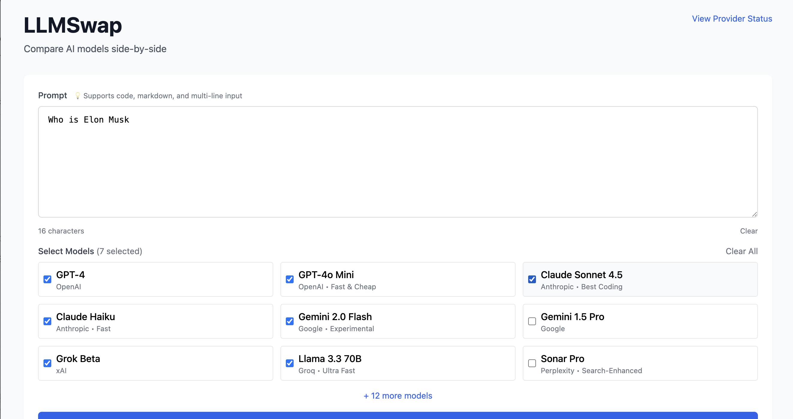

# LLMSwap: Universal LLM SDK + MCP Client

[](https://badge.fury.io/py/llmswap)
[](https://pepy.tech/projects/llmswap)
[](https://github.com/llmswap/homebrew-tap)
[](https://www.python.org/downloads/)
[](https://opensource.org/licenses/MIT)

## Ship AI Apps Faster

**Natural Language MCP + 11 LLM Providers. Latest Models Day-One.**

Claude Opus 4.5 (Nov '25) • Gemini 3 Pro (Nov '25) • GPT-5.1 (Nov '25) • Grok 4.1 (#1 LMArena) + 7 more.  
Universal tool calling • MCP protocol • Zero vendor lock-in • Production-ready SDK + CLI.

One simple interface for Anthropic, OpenAI, Gemini, Groq, X.AI and more. Stop wrestling with complex frameworks—build production AI in 10 lines of code.

**📚 Documentation:** [llmswap.org](https://llmswap.org) | **⚡ CLI Reference:** [CLI Docs](https://llmswap.org/docs/cli.html) | **🐍 SDK Guide:** [SDK Docs](https://llmswap.org/docs/sdk.html) | **🔧 MCP Guide:** [#mcp-integration](#-mcp-integration-new)

## 🆕 NEW in v5.2.0: Universal Tool Calling

**Enable LLMs to access YOUR data and systems** - Define tools once, works across ALL providers.

```python
from llmswap import LLMClient, Tool

# Define tool to access YOUR weather API
weather = Tool(
    name="get_weather",
    description="Get real-time weather data",
    parameters={"city": {"type": "string"}},
    required=["city"]
)

# Works with ANY provider - Anthropic, OpenAI, Gemini, Groq, xAI
client = LLMClient(provider="anthropic")
response = client.chat("What's the weather in Tokyo?", tools=[weather])

# LLM calls YOUR function → you return data → LLM gives natural response
```

**Real-World Use Cases:**
- 🌦️ Give LLM access to YOUR weather API for real-time data
- 💾 Let LLM query YOUR database for customer information
- 🛒 Enable LLM to search YOUR product catalog for shopping assistance
- 🔧 Connect LLM to YOUR systems and APIs

**Works with:** Anthropic, OpenAI, Groq, Gemini, xAI | **[Quick Start Guide →](examples/)** | **[Full Docs →](.llmswap/website-docs/)**

---

## ⚡ Quick Start (30 seconds)

```bash
# Install
pip install llmswap

# or Homebrew
brew tap llmswap/tap && brew install llmswap

# Create your first workspace
cd ~/my-project
llmswap workspace init

# Chat with AI that remembers everything
llmswap chat "Help me with Flask routing"
# AI has full project context + all past learnings!

# 🆕 NEW: Connect to MCP servers with natural language
llmswap-mcp --command npx -y @modelcontextprotocol/server-filesystem ~/Documents
# Ask: "List all PDF files"
# Ask: "Read the contents of README.md"
# AI uses filesystem tools automatically!

# 🆕 Compare models visually (optional)
pip install llmswap[web]
llmswap web  # Opens browser - compare GPT-4 vs Claude vs Gemini
```

---

## 🆕 Latest Models Supported (November 2025)

**New models work the day they launch** - LLMSwap's pass-through architecture means no SDK updates needed.

### ⚡ Claude Opus 4.5 (Released Nov 24, 2025)
```python
from llmswap import LLMClient

client = LLMClient(provider="anthropic", model="claude-opus-4-5")
response = client.chat("Build a full-stack application with authentication...")
print(response.content)
```
**Latest flagship from Anthropic.** State-of-the-art for coding & software engineering. Pricing: $5/$25 per million tokens.  
**Best for:** Complex coding, deep research, software engineering, spreadsheet management

### 🚀 Gemini 3 Pro (Released Nov 18, 2025)
```python
from llmswap import LLMClient

client = LLMClient(provider="gemini", model="gemini-3-pro")
response = client.chat("Analyze this video and extract key insights...")
print(response.content)
```
**Google's most advanced multimodal model.** Processes text, images, videos, audio, PDFs. 1M+ input tokens.  
**Best for:** Multimodal understanding, large document analysis, batch processing

### 🧠 GPT-5.1 (Released Nov 13, 2025)
```python
from llmswap import LLMClient

client = LLMClient(provider="openai", model="gpt-5.1")
response = client.chat("Design an algorithm for real-time fraud detection...")
print(response.content)
```
**OpenAI's latest.** 2-3x faster than GPT-5 with adaptive reasoning. Variants: Instant (speed) & Thinking (reasoning).  
**Best for:** Fast responses, adaptive reasoning, complex problem-solving

### 🏆 Grok 4.1 (Released Nov 17, 2025)
```python
from llmswap import LLMClient

client = LLMClient(provider="xai", model="grok-4.1")
response = client.chat("Help me understand this nuanced ethical dilemma...")
print(response.content)
```
**#1 on LMArena Text Leaderboard.** Enhanced emotional intelligence & creative collaboration. Preferred 64.78% in blind tests.  
**Best for:** Emotional intelligence, creative writing, collaborative tasks, nuanced understanding

**Plus 7 more providers:** Groq (5x faster LPU), Cohere (enterprise), Perplexity (search), IBM Watsonx (Granite 4.0), Ollama, Sarvam AI, local models.

**Why it matters:** New models work day-one. Pass-through architecture means future models work immediately upon release.

---

> **🆕 Use Any Model from Any Provider!** New model just launched? Use it immediately. LLMSwap's pass-through architecture means GPT-5, Claude Opus 4, Gemini 2.5 Pro work the day they release. Currently supports **11 providers** (OpenAI, Anthropic, Gemini, Cohere, Perplexity, IBM watsonx, Groq, Ollama, **xAI Grok**, **Sarvam AI**).

> **✅ Battle-Tested with LMArena Top Models:** All 10 providers tested and validated with top-rated models from LMArena leaderboard. From Grok-4 (xAI's flagship) to Claude Sonnet 4.5 (best coding model) to Gemini 2.0 Flash Exp - every model in our defaults is production-validated and arena-tested for real-world use.

**The First AI Tool with Project Memory & Learning Journals** - LLMSwap v5.1.0 introduces revolutionary workspace system that remembers your learning journey across projects. Build apps without vendor lock-in (SDK) or use from terminal (CLI). Works with your existing subscriptions: Claude, OpenAI, Gemini, Cohere, Perplexity, IBM watsonx, Groq, Ollama, xAI Grok, Sarvam AI (**10 providers**). **Use any model from your provider** - even ones released tomorrow. Pass-through architecture means GPT-5, Gemini 2.5 Pro, Claude Opus 4? They work the day they launch.

**🎯 Solve These Common Problems:**
- ❌ "I need multiple second brains for different aspects of my life" 🆕
- ❌ "AI strays over time, I need to re-steer it constantly" 🆕
- ❌ "I keep explaining the same context to AI over and over"
- ❌ "AI forgets what I learned yesterday"
- ❌ "I lose track of architecture decisions across projects"
- ❌ "Context switching between projects is exhausting"
- ❌ "I want AI to understand my specific codebase, not generic answers"

**✅ llmswap v5.1.0 Solves All These:**
- ✅ Multiple independent "second brains" per project/life aspect 🆕
- ✅ Persistent context prevents AI from straying 🆕
- ✅ Per-project workspaces that persist context across sessions
- ✅ Auto-tracked learning journals - never forget what you learned
- ✅ Architecture decision logs - all your technical decisions documented
- ✅ Zero context switching - AI loads the right project automatically
- ✅ Project-aware AI - mentor understands YOUR specific tech stack

## Why Developers Choose llmswap

✅ **10 Lines to Production** - Not 1000 like LangChain
✅ **MCP Protocol Support** - Connect to any MCP server with natural language 🆕
✅ **Automatic Fallback** - Never down. Switches providers if one fails
✅ **50-90% Cost Savings** - Built-in caching. Same query = FREE
✅ **Workspace Memory** - Your AI remembers your project context
✅ **Universal Tool Calling** - Define once, works everywhere (NEW v5.2.0)
✅ **CLI + SDK** - Code AND terminal. Your choice
✅ **Zero Lock-in** - Switch from OpenAI to Claude in 1 line

**Built for Speed:**
- 🚀 **Hackathons** - Ship in hours
- 💡 **MVPs** - Validate ideas fast
- 📱 **Production Apps** - Scale as you grow
- 🎯 **Real Projects** - Trusted by developers worldwide

**v5.1.0**: Revolutionary AI mentorship with **project memory**, **workspace-aware context**, **auto-tracked learning journals**, and **persistent mentor relationships**. The first AI tool that truly remembers your learning journey across projects.

**NEW in v5.2.0:**
- 🛠️ **Universal Tool Calling** - Enable LLMs to use YOUR custom functions across all providers
- 🔧 **5 Providers Supported** - Anthropic, OpenAI, Groq, Gemini, xAI with automatic format conversion
- 📖 **Complete Documentation** - Full guides, examples, and real-world use cases
- ✅ **100% Backward Compatible** - All existing features work without changes

**v5.1.6:**
- 🌐 **Web UI** - Compare 20+ models side-by-side in beautiful browser interface & learn prompting techniques
- 📊 **Visual Comparison** - Live streaming results with speed badges (⚡🥈🥉), cost charts, efficiency metrics
- 💰 **Cost Optimizer** - See exact costs across providers, find cheapest model for your use case
- 🎨 **Markdown + Code Highlighting** - Syntax-highlighted code blocks with individual copy buttons
- 💾 **Smart Preferences** - Remembers your favorite models via localStorage
- 📈 **Real-time Metrics** - Tokens/sec efficiency, response length indicators, actual API token counts

**NEW in v5.1.0:**
- 🧠 **Workspace Memory** - Per-project context that persists across sessions
- 📚 **Auto-Learning Journal** - Automatically tracks what you learn in each project
- 🎯 **Context-Aware Mentorship** - AI mentor understands your project and past learnings
- 📖 **Architecture Decision Log** - Document and remember key technical decisions
- 🔄 **Cross-Project Intelligence** - Learn patterns from one project, apply to another
- 💡 **Proactive Learning** - AI suggests next topics based on your progress
- 🗂️ **Project Knowledge Base** - Custom prompt library per workspace

## 🧠 Finally: An Elegant Solution for Multiple Second Brains

**The Problem Industry Leaders Can't Solve:**

> "I still haven't found an elegant solution to the fact that I need several second brains for the various aspects of my life, each with different styles and contexts." - Industry feedback

**The LLMSwap Solution: Workspace System**

Each aspect of your life gets its own "brain" with independent memory:

- 💼 **Work Projects** - `~/work/api-platform` - Enterprise patterns, team conventions
- 📚 **Learning** - `~/learning/rust` - Your learning journey, struggles, progress
- 🚀 **Side Projects** - `~/personal/automation` - Personal preferences, experiments
- 🌐 **Open Source** - `~/oss/django` - Community patterns, contribution history

**What Makes It "Elegant":**
- ✅ Zero configuration - just `cd` to project directory
- ✅ Auto-switching - AI loads the right "brain" automatically
- ✅ No context bleed - work knowledge stays separate from personal
- ✅ Persistent memory - each brain remembers across sessions
- ✅ Independent personas - different teaching style per project if you want

**Stop Re-Explaining Context. Start Building.**

---

## 🎯 Transform AI Into Your Personal Mentor with Project Memory

**Inspired by Eklavya** - the legendary self-taught archer who learned from dedication and the right guidance - LLMSwap transforms any AI provider into a personalized mentor that adapts to your learning style **and remembers your journey**.

**The Challenge:** Developers struggle to learn effectively from AI because:
- 🔴 Responses are generic, lack personality, and don't adapt to individual needs
- 🔴 AI loses context between sessions - you repeat the same explanations
- 🔴 No learning history - AI doesn't know what you already learned
- 🔴 Project context is lost - AI doesn't understand your codebase

**LLMSwap's Solution v5.1.0:** Choose your mentorship style, initialize a workspace, and ANY AI provider becomes **your personalized guide that remembers everything**:

```bash
# 🆕 v5.1.0: Initialize workspace for your project
cd ~/my-flask-app
llmswap workspace init
# Creates .llmswap/ with context.md, learnings.md, decisions.md

# Now your AI mentor KNOWS your project
llmswap chat --mentor guru --alias "Guruji"
# Mentor has full context: your tech stack, past learnings, decisions made

# 🆕 Auto-tracked learning journal
# Every conversation automatically saves key learnings
llmswap workspace journal
# View everything you've learned in this project

# 🆕 Architecture decision log
llmswap workspace decisions
# See all technical decisions documented automatically

# View all your workspaces
llmswap workspace list

# Get wisdom and deep insights from a patient teacher
llmswap chat --mentor guru --alias "Guruji"

# High-energy motivation when you're stuck
llmswap ask "How do I debug this?" --mentor coach

# Collaborative peer learning for exploring ideas
llmswap chat --mentor friend --alias "CodeBuddy"

# Question-based learning for critical thinking
llmswap ask "Explain REST APIs" --mentor socrates

# 🆕 Use Claude Sonnet 4.5 - Best coding model
llmswap chat --provider anthropic --model claude-sonnet-4-5
# Or set as default in config for all queries
```

### 🔄 Rotate Personas to Expose Blind Spots

**Industry Insight:** "Rotate personas: mentor, skeptic, investor, end-user. Each lens exposes blind spots differently."

**Use Case: Reviewing API Design**

```bash
# Round 1: Long-term wisdom
llmswap chat --mentor guru "Design API for multi-tenant SaaS"
# Catches: scalability, technical debt, maintenance

# Round 2: Critical questions
llmswap chat --mentor socrates "Review this API design"
# Catches: assumptions, alternatives, edge cases

# Round 3: Practical execution
llmswap chat --mentor coach "What's the fastest path to v1?"
# Catches: over-engineering, paralysis by analysis
```

**Same project context. Different perspectives. Complete understanding.**

**What Makes v5.1.0 Revolutionary:**
- 🧠 **Works with ANY provider** - Transform Claude, GPT-4, or Gemini into your mentor
- 🎭 **6 Teaching Personas** - Guru, Coach, Friend, Socrates, Professor, Tutor
- 📊 **Project Memory** - Per-project context that persists across sessions ⭐ NEW
- 📚 **Auto-Learning Journal** - Automatically tracks what you learn ⭐ NEW
- 📖 **Decision Tracking** - Documents architecture decisions ⭐ NEW
- 🎓 **Age-Appropriate** - Explanations tailored to your level (--age 10, --age 25, etc.)
- 💰 **Cost Optimized** - Use cheaper providers for learning, premium for complex problems
- 🔄 **Workspace Detection** - Automatically loads project context ⭐ NEW

**Traditional AI tools give you answers. LLMSwap v5.1.0 gives you a personalized learning journey that REMEMBERS.**

---

## 🔧 MCP Integration (NEW)

**The Model Context Protocol (MCP)** lets LLMs connect to external tools and data sources. llmswap provides the **best MCP client experience** - just talk naturally, and AI handles the tools.

### Natural Language MCP CLI

Connect to any MCP server and interact with tools using plain English:

```bash
# Filesystem access
llmswap-mcp --command npx -y @modelcontextprotocol/server-filesystem ~/Documents

# Then ask naturally:
> "What files are in this directory?"
> "Read the contents of report.pdf"
> "Find all files modified in the last week"

# Database queries
llmswap-mcp --command npx -y @modelcontextprotocol/server-sqlite ./mydb.sqlite

> "Show me all users in the database"
> "What are the top 10 products by sales?"

# GitHub integration
llmswap-mcp --command npx -y @modelcontextprotocol/server-github --owner anthropics --repo anthropic-sdk-python

> "Show me recent issues"
> "What pull requests are open?"
```

### Supported MCP Transports

- **stdio** - Local command-line tools (most common)
- **SSE** - Server-Sent Events for remote servers
- **HTTP** - REST API endpoints

### Works With All 5 Providers

```bash
# Use your preferred LLM provider
llmswap-mcp --provider anthropic --command <mcp-server>
llmswap-mcp --provider openai --command <mcp-server>
llmswap-mcp --provider gemini --command <mcp-server>
llmswap-mcp --provider groq --command <mcp-server>    # Fastest!
llmswap-mcp --provider xai --command <mcp-server>     # Grok
```

### Python SDK Integration

```python
from llmswap import LLMClient

# Add MCP server to your client
client = LLMClient(provider="anthropic")
client.add_mcp_server("filesystem", command=["npx", "-y", "@modelcontextprotocol/server-filesystem", "/tmp"])

# Chat naturally - AI uses MCP tools automatically
response = client.chat("List all log files in /tmp", use_mcp=True)
print(response.content)

# List available tools
tools = client.list_mcp_tools()
for tool in tools:
    print(f"- {tool['name']}: {tool['description']}")
```

### Popular MCP Servers

- **Filesystem** - Read/write files and directories
- **GitHub** - Search repos, issues, PRs
- **GitLab** - Project management
- **Google Drive** - Access documents
- **Slack** - Send messages, read channels
- **PostgreSQL** - Database queries
- **Brave Search** - Web search
- **Memory** - Persistent knowledge graphs

[Browse all MCP servers →](https://github.com/modelcontextprotocol/servers)

### MCP Features

✅ **Natural language interface** - No JSON, no manual tool calls  
✅ **Multi-turn conversations** - Context preserved across queries  
✅ **Beautiful UI** - Clean bordered interface like Claude/Factory Droids  
✅ **Provider-specific formatting** - Optimized for each LLM  
✅ **Connection management** - Automatic reconnection and health checks  
✅ **Error handling** - Graceful degradation with circuit breaker

### Example Use Cases

**For Data Analysis:**
```bash
llmswap-mcp --command npx -y @modelcontextprotocol/server-sqlite ./sales.db
> "What were our top 5 products last quarter?"
> "Show me revenue trends by region"
```

**For Development:**
```bash
llmswap-mcp --command npx -y @modelcontextprotocol/server-github --owner myorg --repo myapp
> "What issues are labeled as bugs?"
> "Summarize recent commits"
```

**For Research:**
```bash
llmswap-mcp --command npx -y @modelcontextprotocol/server-brave-search
> "Find recent papers on transformer architectures"
> "What are the latest developments in quantum computing?"
```

---

## 🏢 Enterprise Deployment

### Remote MCP Servers (Production)

#### SSE Transport (Server-Sent Events)
```python
from llmswap import LLMClient
import os

# Connect to internal MCP server via SSE
client = LLMClient(provider="anthropic")
client.add_mcp_server(
    "internal-api",
    transport="sse",
    url="https://mcp.yourcompany.com/events",
    headers={
        "Authorization": f"Bearer {os.getenv('INTERNAL_MCP_TOKEN')}"
    }
)

# Use with natural language
response = client.chat("Query internal data", use_mcp=True)
```

#### HTTP Transport (REST API)
```python
# Connect to MCP server via HTTP
client.add_mcp_server(
    "crm-api",
    transport="http", 
    url="https://api.yourcompany.com/mcp",
    headers={
        "X-API-Key": os.getenv('CRM_API_KEY')
    }
)

# Query your internal systems
response = client.chat("Get customer data for account #12345", use_mcp=True)
```

### Production Features

#### Health Monitoring
```python
# Check MCP server health
if not client.check_mcp_health("internal-api"):
    logger.error("MCP server unhealthy")
    # Fallback logic
```

#### Circuit Breaker (Built-in)
```python
# Automatic circuit breaker prevents cascade failures
client.add_mcp_server(
    "backend-api",
    transport="sse",
    url="https://backend.company.com/mcp",
    circuit_breaker_threshold=5,  # Opens after 5 failures
    circuit_breaker_timeout=60     # Retry after 60 seconds
)
```

### Multi-Provider Routing

#### Cost Optimization
```python
# Route to cheapest provider first, fallback to premium
try:
    response = LLMClient(provider="groq").chat(query)  # Fast & cheap
except:
    response = LLMClient(provider="anthropic").chat(query)  # Premium fallback
```

#### Latency Optimization
```python
# Route based on latency requirements
if requires_realtime:
    client = LLMClient(provider="groq")  # 840+ tokens/sec
else:
    client = LLMClient(provider="openai")  # More capable
```

#### Provider Fallback Chain
```python
from llmswap import LLMClient

providers = ["groq", "anthropic", "openai"]  # Priority order

for provider in providers:
    try:
        client = LLMClient(provider=provider)
        response = client.chat(query)
        break
    except Exception as e:
        logger.warning(f"{provider} failed: {e}")
        continue
```

---

## 🔒 Security & Compliance

### API Key Management

#### Environment Variables (Recommended)
```bash
# Never hardcode API keys
export ANTHROPIC_API_KEY="sk-ant-..."
export OPENAI_API_KEY="sk-..."
export INTERNAL_MCP_TOKEN="your-token"
```

```python
import os
from llmswap import LLMClient

# Keys loaded from environment automatically
client = LLMClient(provider="anthropic")  # Uses ANTHROPIC_API_KEY
```

#### Secrets Management Integration

**AWS Secrets Manager:**
```python
import boto3
import json
from llmswap import LLMClient

def get_secret(secret_name):
    client = boto3.client('secretsmanager')
    response = client.get_secret_value(SecretId=secret_name)
    return json.loads(response['SecretString'])

secrets = get_secret('llm-api-keys')
client = LLMClient(provider="anthropic", api_key=secrets['anthropic_key'])
```

**Azure Key Vault:**
```python
from azure.identity import DefaultAzureCredential
from azure.keyvault.secrets import SecretClient
from llmswap import LLMClient

credential = DefaultAzureCredential()
vault_client = SecretClient(
    vault_url="https://your-vault.vault.azure.net", 
    credential=credential
)

api_key = vault_client.get_secret("anthropic-api-key").value
client = LLMClient(provider="anthropic", api_key=api_key)
```

**HashiCorp Vault:**
```python
import hvac
from llmswap import LLMClient

vault_client = hvac.Client(url='https://vault.company.com')
vault_client.auth.approle.login(role_id=..., secret_id=...)

secret = vault_client.secrets.kv.v2.read_secret_version(path='llm-keys')
api_key = secret['data']['data']['anthropic_key']

client = LLMClient(provider="anthropic", api_key=api_key)
```

### Data Privacy

**Zero Telemetry:**
- LLMSwap collects NO usage data
- NO analytics sent to third parties
- NO phone-home behavior

**Data Flow:**
```
Your Application → LLMSwap → LLM Provider API
                              ↑
                    Your data goes ONLY here
                    (governed by provider's privacy policy)
```

**On-Premise MCP Servers:**
```python
# All data stays within your infrastructure
client.add_mcp_server(
    "internal-db",
    transport="http",
    url="https://internal.company.local/mcp"  # Internal network only
)
```

### Network Security

#### TLS/SSL Enforcement
```python
# HTTPS enforced for remote connections
client.add_mcp_server(
    "api",
    transport="https",
    url="https://secure.company.com/mcp",
    verify_ssl=True  # Certificate verification
)
```

#### Timeout Controls
```python
# Prevent hanging connections
client = LLMClient(
    provider="anthropic",
    timeout=30  # 30 second timeout
)
```

### Audit Logging

```python
import logging

# Enable detailed logging for compliance
logging.basicConfig(level=logging.INFO)
logger = logging.getLogger('llmswap')

# Logs include:
# - Provider used
# - Token usage
# - MCP tool calls
# - Error details
# - No sensitive data (keys redacted)
```

### Compliance Notes

**SOC2 / GDPR Considerations:**
- LLMSwap is a client library - does NOT store data
- Data retention governed by your chosen LLM provider
- See provider compliance: [Anthropic](https://www.anthropic.com/security), [OpenAI](https://openai.com/security), [Google](https://cloud.google.com/security/compliance)

**Industry Standards:**
- Uses standard HTTPS/TLS for transport security
- Supports enterprise authentication (OAuth, API keys, custom headers)
- No vendor lock-in - switch providers without code changes

---

## 🐳 Production Deployment

### Docker

#### Simple Dockerfile
```dockerfile
FROM python:3.11-slim

# Install llmswap
RUN pip install llmswap

# Set working directory
WORKDIR /app

# Copy your application
COPY . .

# Environment variables set at runtime
ENV ANTHROPIC_API_KEY=""
ENV MCP_SERVER_URL=""

# Run your application
CMD ["python", "your_app.py"]
```

#### Multi-Stage Build (Optimized)
```dockerfile
# Build stage
FROM python:3.11-slim as builder

RUN pip install --user llmswap

# Runtime stage
FROM python:3.11-slim

COPY --from=builder /root/.local /root/.local
ENV PATH=/root/.local/bin:$PATH

WORKDIR /app
COPY . .

CMD ["python", "your_app.py"]
```

#### Docker Compose
```yaml
version: '3.8'

services:
  llmswap-app:
    build: .
    environment:
      - ANTHROPIC_API_KEY=${ANTHROPIC_API_KEY}
      - OPENAI_API_KEY=${OPENAI_API_KEY}
      - MCP_SERVER_URL=https://mcp.company.com
    networks:
      - internal
    restart: unless-stopped

networks:
  internal:
    driver: bridge
```

### Kubernetes

#### Deployment
```yaml
apiVersion: apps/v1
kind: Deployment
metadata:
  name: llmswap-service
  labels:
    app: llmswap
spec:
  replicas: 3
  selector:
    matchLabels:
      app: llmswap
  template:
    metadata:
      labels:
        app: llmswap
    spec:
      containers:
      - name: llmswap
        image: your-registry/llmswap-app:latest
        env:
        - name: ANTHROPIC_API_KEY
          valueFrom:
            secretKeyRef:
              name: llm-secrets
              key: anthropic-key
        - name: OPENAI_API_KEY
          valueFrom:
            secretKeyRef:
              name: llm-secrets
              key: openai-key
        resources:
          requests:
            memory: "256Mi"
            cpu: "100m"
          limits:
            memory: "512Mi"
            cpu: "500m"
        livenessProbe:
          httpGet:
            path: /health
            port: 8080
          initialDelaySeconds: 30
          periodSeconds: 10
        readinessProbe:
          httpGet:
            path: /ready
            port: 8080
          initialDelaySeconds: 5
          periodSeconds: 5
```

#### Secrets Management
```yaml
apiVersion: v1
kind: Secret
metadata:
  name: llm-secrets
type: Opaque
data:
  anthropic-key: <base64-encoded-key>
  openai-key: <base64-encoded-key>
```

```bash
# Create secrets from file
kubectl create secret generic llm-secrets \
  --from-literal=anthropic-key=$ANTHROPIC_API_KEY \
  --from-literal=openai-key=$OPENAI_API_KEY
```

#### Service
```yaml
apiVersion: v1
kind: Service
metadata:
  name: llmswap-service
spec:
  selector:
    app: llmswap
  ports:
  - protocol: TCP
    port: 80
    targetPort: 8080
  type: ClusterIP
```

#### ConfigMap (MCP Configuration)
```yaml
apiVersion: v1
kind: ConfigMap
metadata:
  name: mcp-config
data:
  mcp-servers.json: |
    {
      "internal-api": {
        "transport": "sse",
        "url": "https://mcp.company.com/events"
      },
      "crm-system": {
        "transport": "http",
        "url": "https://crm-api.company.com/mcp"
      }
    }
```

### Environment Variables Reference

```bash
# LLM Provider API Keys
ANTHROPIC_API_KEY=sk-ant-...
OPENAI_API_KEY=sk-...
GEMINI_API_KEY=...
GROQ_API_KEY=gsk_...
XAI_API_KEY=xai-...

# MCP Configuration
MCP_SERVER_URL=https://mcp.company.com
MCP_AUTH_TOKEN=your-token

# Optional: Override defaults
LLMSWAP_DEFAULT_PROVIDER=anthropic
LLMSWAP_TIMEOUT=30
LLMSWAP_LOG_LEVEL=INFO
```

### Health Checks

```python
# your_app.py
from flask import Flask, jsonify
from llmswap import LLMClient

app = Flask(__name__)
client = LLMClient(provider="anthropic")

@app.route('/health')
def health():
    """Kubernetes liveness probe"""
    return jsonify({"status": "healthy"}), 200

@app.route('/ready')
def ready():
    """Kubernetes readiness probe"""
    try:
        # Check if LLM provider is accessible
        client.chat("test", max_tokens=1)
        return jsonify({"status": "ready"}), 200
    except Exception as e:
        return jsonify({"status": "not ready", "error": str(e)}), 503

if __name__ == '__main__':
    app.run(host='0.0.0.0', port=8080)
```

### Monitoring & Observability

#### Prometheus Metrics (Example)
```python
from prometheus_client import Counter, Histogram, start_http_server
from llmswap import LLMClient

# Metrics
llm_requests = Counter('llm_requests_total', 'Total LLM requests', ['provider'])
llm_latency = Histogram('llm_request_duration_seconds', 'LLM request latency', ['provider'])
llm_errors = Counter('llm_errors_total', 'Total LLM errors', ['provider', 'error_type'])

# Start metrics endpoint
start_http_server(9090)

# Instrument your calls
client = LLMClient(provider="anthropic")
with llm_latency.labels(provider="anthropic").time():
    try:
        response = client.chat("query")
        llm_requests.labels(provider="anthropic").inc()
    except Exception as e:
        llm_errors.labels(provider="anthropic", error_type=type(e).__name__).inc()
        raise
```

---

## 🏆 Production-Validated with LMArena Top Models

**Every model in LLMSwap's defaults comes from LMArena's top performers:**

All 10 providers ship with carefully selected default models based on LMArena rankings and real-world production testing. We track arena performance and update defaults to ensure you're always using validated, battle-tested models.

| Provider | Default Model | Arena Status | Why We Chose It |
|----------|---------------|--------------|-----------------|
| **Anthropic** | claude-sonnet-4-5 | #1 Coding | Best coding model in the world (Sept 2025) |
| **xAI** | grok-4-0709 | Top 5 Overall | Advanced reasoning, real-time data access |
| **Gemini** | gemini-2.0-flash-exp | Top 10 | Lightning-fast, multimodal, cutting-edge |
| **OpenAI** | gpt-4o-mini | Cost Leader | Best price/performance ratio |
| **Cohere** | command-r-08-2024 | Top RAG | Enterprise-grade retrieval-augmented generation |
| **Perplexity** | sonar | Web Search | Real-time web-connected AI with citations |
| **Groq** | llama-3.1-8b-instant | Speed King | 840+ tokens/second ultra-fast inference |
| **Sarvam** | sarvam-m | Multilingual | 24B params, best for 10 Indian languages |
| **Watsonx** | granite-3-8b-instruct | Enterprise | IBM's production-grade AI for business |
| **Ollama** | granite-code:8b | Local AI | Privacy-first, runs on your hardware |

**✅ Battle-tested with real API calls** - Every provider validated in production, not simulated tests.

**✅ Weekly model updates** - We monitor LMArena rankings and deprecation notices to keep defaults current.

**✅ Zero lock-in** - Don't like our defaults? Override with any model: `LLMClient(model="gpt-5")` or `llmswap config set provider.models.openai gpt-5`

---

## 🔓 Use Any Model Your Provider Supports (Zero-Wait Model Support)

Here's something cool: LLMSwap doesn't restrict which models you can use. When GPT-5 or Gemini 2.5 Pro drops tomorrow, you can start using it immediately. No waiting for us to update anything.

**How?** We use pass-through architecture. Whatever model name you pass goes directly to your provider's API. We don't gatekeep.

### CLI Examples:

```bash
# Use any OpenAI model (even ones that don't exist yet)
llmswap chat --provider openai --model gpt-5
llmswap chat --provider openai --model o3-mini

# Use any Anthropic model
llmswap chat --provider anthropic --model claude-opus-4
llmswap chat --provider anthropic --model claude-sonnet-4-5

# Use any Gemini model
llmswap chat --provider gemini --model gemini-2-5-pro
llmswap chat --provider gemini --model gemini-ultra-2

# Set as default so you don't have to type it every time
llmswap config set provider.models.openai gpt-5
llmswap config set provider.models.anthropic claude-opus-4
```

### Python SDK:

```python
from llmswap import LLMClient

# Use whatever model your provider offers
client = LLMClient(provider="openai", model="gpt-5")
client = LLMClient(provider="anthropic", model="claude-opus-4")
client = LLMClient(provider="gemini", model="gemini-2-5-pro")

# Model just released? Use it right now
client = LLMClient(provider="openai", model="gpt-6")  # works!
```

**The point:** You're not limited to what we've documented. If your provider supports it, llmswap supports it.

## 🆚 LLMSwap vs Single-Provider Tools

### For Python Developers Building Apps:

| Your Need | Single-Provider SDKs | LLMSwap SDK |
|-----------|---------------------|-------------|
| Build chatbot/app | Import `openai` library (locked in) | Import `llmswap` (works with any provider) |
| Switch providers | Rewrite all API calls | Change 1 line: `provider="anthropic"` |
| Try different models | Sign up, new SDK, refactor code | Just change config, same code |
| Use new models | Wait for SDK update | Works immediately (pass-through) |
| Cost optimization | Manual implementation | Built-in caching (50-90% savings) |
| Use multiple providers | Maintain separate codebases | One codebase, switch dynamically |

### For Developers Using Terminal:

| Your Need | Vendor CLIs | LLMSwap CLI |
|-----------|-------------|-------------|
| Have Claude subscription | Install Claude Code (Claude only) | Use llmswap (works with Claude) |
| Have OpenAI subscription | Build your own scripts | Use llmswap (works with OpenAI) |
| Have multiple subscriptions | Install 3+ different CLIs | One CLI for all subscriptions |
| New model launches | Wait for CLI update | Use it same day (pass-through) |
| Want AI to teach you | Not available | Built-in Eklavya mentorship |
| Switch providers mid-chat | Can't - locked in | `/switch anthropic` command |

**The Bottom Line:**
- **Building an app?** Use LLMSwap SDK - no vendor lock-in
- **Using terminal?** Use LLMSwap CLI - works with your existing subscriptions
- **Both?** Perfect - it's the same tool!

---

## 🔧 LLMSwap vs MCP Alternatives

**The only multi-provider MCP client with natural language interface:**

| Feature | LLMSwap | langchain-mcp-tools | mcp-use | Anthropic SDK |
|---------|---------|---------------------|---------|---------------|
| **Natural Language** | ✅ Ask in plain English | ❌ Manual JSON | ❌ Manual JSON | ❌ Manual JSON |
| **Multi-Provider MCP** | ✅ 11 providers | ❌ LangChain only | ⚠️ Limited | ❌ Claude only |
| **Latest Models** | ✅ Day-one support (Dec '24) | ⚠️ Delayed updates | ⚠️ Delayed updates | ✅ Claude only |
| **Beautiful CLI** | ✅ Bordered UI | ❌ No CLI | ❌ Basic | ❌ No CLI |
| **Setup Time** | 🟢 30 seconds | 🔴 Hours (LangChain) | 🟡 Medium | 🟢 Fast |
| **Production Ready** | ✅ Circuit breakers | ❌ DIY | ❌ DIY | ⚠️ Limited |
| **Cost Optimization** | ✅ Auto caching | ❌ Manual | ❌ Manual | ❌ No |
| **Learning Curve** | 🟢 10 lines | 🔴 Complex | 🟡 Medium | 🟢 Easy |
| **Remote MCP** | ✅ SSE/HTTP | ⚠️ Limited | ⚠️ Limited | ✅ Yes |
| **Zero Lock-in** | ✅ Switch providers | ❌ Locked to LangChain | ⚠️ Limited | ❌ Claude only |

**Why LLMSwap for MCP?**
- **Natural language**: Just ask "List all PDFs" - no JSON schemas
- **Universal**: Works with 11 providers, not just one
- **Production-ready**: Circuit breakers, health checks, monitoring built-in
- **Latest models**: Claude 3.5 Haiku, Gemini 2.0, o1 work day-one

---

```bash
# 🆕 NEW v5.1.0: Workspace System - Project Memory That Persists
llmswap workspace init
# Creates .llmswap/ directory with:
#   - workspace.json (project metadata)
#   - context.md (editable project description)
#   - learnings.md (auto-tracked learning journal)
#   - decisions.md (architecture decision log)

llmswap workspace list                    # View all your workspaces
llmswap workspace info                    # Show current workspace statistics
llmswap workspace journal                 # View learning journal
llmswap workspace decisions               # View decision log
llmswap workspace context                 # Edit project context

# 🆕 NEW v5.1.0: Context-Aware Mentorship
# AI mentor automatically loads project context, past learnings, and decisions
llmswap chat
# Mentor knows: your tech stack, what you've learned, decisions made

# 🆕 NEW v5.0: Age-Appropriate AI Explanations
llmswap ask "What is Docker?" --age 10
# Output: "Docker is like a magic lunch box! 🥪 When your mom packs..."

llmswap ask "What is blockchain?" --audience "business owner"
# Output: "Think of blockchain like your business ledger system..."

# 🆕 NEW v5.0: Teaching Personas & Personalization  
llmswap ask "Explain Python classes" --teach --mentor developer --alias "Sarah"
# Output: "[Sarah - Senior Developer]: Here's how we handle classes in production..."

# 🆕 NEW v5.0: Conversational Chat with Provider Switching
llmswap chat --age 25 --mentor tutor
# In chat: /switch anthropic  # Switch mid-conversation
# In chat: /provider         # See current provider
# Commands: /help, /switch, /clear, /stats, /quit

# 🆕 NEW v5.0: Provider Management & Configuration
llmswap providers                    # View all providers and their status
llmswap config set provider.models.cohere command-r-plus-08-2024
llmswap config set provider.default anthropic
llmswap config show

# Code Generation (GitHub Copilot CLI Alternative)
llmswap generate "sort files by size in reverse order"
# Output: du -sh * | sort -hr

llmswap generate "Python function to read JSON with error handling" --language python
# Output: Complete Python function with try/catch blocks

# Advanced Log Analysis with AI
llmswap logs --analyze /var/log/app.log --since "2h ago"
llmswap logs --request-id REQ-12345 --correlate

# Code Review & Debugging
llmswap review app.py --focus security
llmswap debug --error "IndexError: list index out of range"
```

```python
# ❌ Problem: Vendor Lock-in
import openai  # Locked to OpenAI forever
client = openai.Client(api_key="sk-...")
response = client.chat.completions.create(
    model="gpt-4",
    messages=[{"role": "user", "content": "Hello"}]
)
# To switch to Claude? Rewrite everything.

# ✅ Solution: llmswap SDK - Universal Interface
from llmswap import LLMClient

# Works with any provider you're subscribed to
client = LLMClient()  # Auto-detects from env vars
response = client.query("Hello")

# Want Claude instead? Just change provider:
client = LLMClient(provider="anthropic")  # That's it!

# Want to try Gemini? 
client = LLMClient(provider="gemini")  # Same code, different provider

# Built-in cost optimization:
# - Automatic response caching (50-90% savings)
# - Provider cost comparison
# - Smart provider selection based on query type
```

## 🆕 v5.1.0: Workspace System - Real-World Scenarios

### 🎯 **Scenario 1: New Developer Learning Flask**

**Problem:** Junior developer learning Flask keeps asking AI the same questions because AI forgets previous conversations.

**Solution with llmswap v5.1.0:**
```bash
cd ~/my-first-flask-app
llmswap workspace init --name "Learning Flask"

# Day 1: Learn about routing
llmswap chat --mentor professor
"How do Flask routes work?"
# AI explains. Learning auto-saved to learnings.md

# Day 2: Same workspace, AI remembers!
llmswap chat
"Can I use decorators for authentication?"
# AI response: "Building on what you learned about routes yesterday..."
# No need to re-explain basics!

# View your learning journey
llmswap workspace journal
# See: Day 1 - Routes, Day 2 - Authentication, etc.
```

**Result:** 60% faster learning because AI builds on previous knowledge instead of repeating basics.

---

### 🏢 **Scenario 2: Team Onboarding on Legacy Project**

**Problem:** New team member joins 2-year-old codebase. Spends weeks understanding architecture decisions.

**Solution with llmswap v5.1.0:**
```bash
cd ~/legacy-ecommerce-app
llmswap workspace init

# Edit context.md with project overview
llmswap workspace context
# Add: Tech stack, key components, known issues

# Ask questions - AI has full context
llmswap ask "Why did we choose MongoDB over PostgreSQL?" --mentor guru
# AI suggests checking decisions.md
# If documented: "According to your decision log from 2023-05..."
# If not: AI helps document it now

llmswap workspace decisions
# See all past architectural decisions in one place
```

**Result:** Onboarding time reduced from 3 weeks to 1 week.

---

### 💼 **Scenario 3: Freelancer Managing Multiple Projects**

**Problem:** Freelancer switches between 5 client projects daily. Context switching is exhausting.

**Solution with llmswap v5.1.0:**
```bash
# Morning: Client A's React project
cd ~/client-a-dashboard
llmswap chat
# AI loads: React patterns you learned, components built, state management decisions

# Afternoon: Client B's Python API
cd ~/client-b-api
llmswap chat
# AI switches context: Python best practices, API design decisions, database schema

# List all projects
llmswap workspace list
# See: 5 workspaces, each with independent context and learnings

# Each workspace has separate:
# - Learning journal (React patterns vs Python patterns)
# - Decision log (frontend vs backend decisions)
# - Project context (different tech stacks)
```

**Result:** Zero mental overhead for context switching. AI handles it automatically.

---

### 🎓 **Scenario 4: Learning Journey Across Technologies**

**Problem:** Developer learning full-stack wants to track progress across frontend, backend, DevOps.

**Solution with llmswap v5.1.0:**
```bash
# Frontend project
cd ~/react-app
llmswap workspace init --name "React Learning"
llmswap chat --mentor tutor
# Learn: Hooks, State, Components
# All auto-tracked in learnings.md

# Backend project
cd ~/python-api
llmswap workspace init --name "Python API"
llmswap chat --mentor tutor
# Learn: FastAPI, SQLAlchemy, Testing
# Separate learning journal

# View all learning across projects
llmswap workspace list
# See progress in each area

# Each workspace shows:
# - Total queries
# - Learnings count
# - Last accessed
```

**Result:** Complete visibility into learning journey across all technologies.

---

### 🚀 **Scenario 5: Open Source Contributor**

**Problem:** Contributing to 3 different OSS projects. Each has different conventions, patterns, testing approaches.

**Solution with llmswap v5.1.0:**
```bash
# Project 1: Django
cd ~/django-oss
llmswap workspace init
# Document in context.md: Coding style, PR process, testing patterns

# Project 2: FastAPI
cd ~/fastapi-oss
llmswap workspace init
# Different conventions, different patterns

# Ask project-specific questions
cd ~/django-oss
llmswap ask "How should I write tests here?"
# AI knows: This project uses pytest with Django TestCase

cd ~/fastapi-oss
llmswap ask "How should I write tests here?"
# AI knows: This project uses pytest with async fixtures

# Each workspace maintains separate:
# - Testing patterns learned
# - Code review feedback
# - Architecture understanding
```

**Result:** Contribute confidently to multiple projects without mixing up conventions.

---

## 💡 Real-World Use Cases (v5.0 Features)

### 📚 **Learning & Skill Development**
```bash
# Junior developer learning system design
llmswap chat --mentor professor --alias "Dr. Smith"
"Explain microservices architecture"
# Response adapts to teaching style with examples and deep explanations

# Career switcher exploring new domains
llmswap ask "What is Kubernetes?" --age 25 --audience "beginner"
# Age-appropriate explanation without assuming prior DevOps knowledge
```

### 🚀 **Professional Development**
```bash
# Get different perspectives on technical decisions
llmswap ask "Should I use MongoDB or PostgreSQL?" --mentor guru
# Wisdom-based response considering trade-offs and bigger picture

llmswap ask "Should I use MongoDB or PostgreSQL?" --mentor developer
# Practical engineering perspective with production experience
```

### 💼 **Team Collaboration**
```bash
# Explain technical concepts to non-technical stakeholders
llmswap ask "Explain our API architecture" --audience "business owner"
# Business-friendly explanation without jargon

# Onboard new team members
llmswap chat --mentor friend --alias "TeamBuddy"
# Collaborative, approachable learning environment
```

### 🎭 **Same Question, Different Perspectives**

Watch how the SAME question gets tailored responses based on your role:

```bash
# As a Developer: Implementation focus
llmswap ask "Explain Model Context Protocol (MCP)" --audience developer

Response: "MCP is a standardized protocol for connecting AI models to external 
data sources and tools. Unlike traditional chatbots that bundle everything into 
one monolithic system, MCP uses a client-server architecture:

- Server: Exposes tools, resources, and prompts via standard interface
- Client: Your AI application that consumes these capabilities
- Transport: JSON-RPC over stdio/HTTP

Key difference from older chatbots:
OLD: Hardcoded integrations, tight coupling, monolithic deployment
NEW: Pluggable architecture, loose coupling, independent tool servers

Code example:
from mcp import Server
server = Server("my-tools")
@server.tool()
def get_weather(city: str): ..."

---

# As an Architect: System design focus  
llmswap ask "Explain Model Context Protocol (MCP)" --audience architect

Response: "MCP introduces a service-oriented architecture for AI systems, 
addressing key architectural concerns:

**System Architecture:**
┌─────────────┐      ┌──────────────┐      ┌─────────────┐
│ AI Client   │◄────►│ MCP Protocol │◄────►│ Tool Server │
│ (Claude App)│      │  (JSON-RPC)  │      │ (Resources) │
└─────────────┘      └──────────────┘      └─────────────┘

**Design Patterns:**
- Service Discovery: Dynamic capability negotiation
- Loose Coupling: Clients/servers evolve independently  
- Extensibility: Add new tools without modifying core
- Standardization: Uniform interface across tools

**vs Traditional Chatbots:**
- Monolithic → Microservices for AI tools
- Static → Dynamic capability loading
- Vendor lock-in → Provider-agnostic standard

**Scalability:** Deploy tool servers independently, horizontal scaling per service"

---

# As a Business Leader: ROI and strategy focus
llmswap ask "Explain Model Context Protocol (MCP)" --audience "business leader"

Response: "Model Context Protocol (MCP) is like moving from custom-built 
integrations to standardized APIs - but for AI systems.

**Business Impact:**

1. **Reduced Integration Costs**
   - OLD: $50K-$100K per custom AI integration
   - NEW: Plug-and-play tools, 80% cost reduction
   - Time to market: Weeks instead of months

2. **Vendor Independence**  
   - Not locked to one AI provider
   - Switch between Claude, GPT-4, Gemini seamlessly
   - Negotiating power with vendors

3. **Reusable Components**
   - Build once, use across multiple AI applications
   - Internal tools become valuable assets
   - Ecosystem of third-party MCP tools

4. **Competitive Advantage**
   - Deploy AI features 10x faster than competitors
   - Respond quickly to market changes
   - Lower total cost of ownership

**vs Traditional Chatbots:** Traditional bots were closed systems requiring 
custom development for each feature. MCP creates an open ecosystem where your 
team (or partners) can extend capabilities without vendor dependencies.

**ROI Example:** A company saved $200K in integration costs and reduced 
deployment time from 6 months to 3 weeks using MCP architecture."
```

**The Power:** Same command, same AI provider, completely different responses tailored to what each role needs to know.

## ⚠️ Privacy & Usage Disclaimers

**llmswap is an interface tool only** - all AI interactions and billing are handled directly by your chosen providers.

### 🔒 Context Privacy & Provider Switching
- **No context sharing**: When switching providers mid-conversation, NO conversation history is transferred between providers
- **Fresh start**: Each provider switch starts a completely new conversation thread
- **Legal compliance**: This protects your privacy and complies with provider Terms of Service
- **Your control**: You decide what each provider sees in their separate conversations

### 💰 Cost Information
**Cost estimates** (`~$X.XX estimated`) are approximate based on public pricing and common tokenizers. Actual costs may differ. **You are responsible for all provider costs and billing.**

**Legal Notice**: llmswap provides estimates and interface functionality for convenience only. We are not responsible for billing differences, provider charges, pricing changes, or data handling by individual providers. Always verify costs with your provider's billing dashboard.

## ⚡ Get Started in 30 Seconds

### 🍺 Homebrew (Recommended - macOS/Linux)
```bash
# Add our tap and install
brew tap llmswap/tap
brew install llmswap

# Ready to use immediately!
llmswap --help
```

### 🐍 PyPI (All platforms)
```bash
pip install llmswap
```

**Why Homebrew?** No virtualenv needed, global access, automatic dependency management, and easier updates.

## 🚀 Quick Start with Workspaces (v5.1.0)

### Complete Beginner's Guide - 3 Steps:

**Step 1: Install llmswap**
```bash
pip install llmswap
# or
brew install llmswap
```

**Step 2: Set up API key (one provider is enough)**
```bash
export ANTHROPIC_API_KEY="your-key-here"  # For Claude
# or
export OPENAI_API_KEY="your-key-here"     # For GPT-4
# or any other provider
```

**Step 3: Initialize workspace in your project**
```bash
cd ~/my-project
llmswap workspace init

# Start chatting - AI has full project context!
llmswap chat --mentor guru
# Ask anything about your project
# Learnings automatically tracked
# Decisions automatically documented

# View your learning journey
llmswap workspace journal
```

**That's it!** Your AI mentor now remembers everything about your project. 🎉

### Without Workspace (Classic Mode)
```bash
# Works exactly like v5.0 - no workspace needed
llmswap ask "How do I deploy a Flask app?"
llmswap chat --mentor tutor
llmswap generate "Python function to read CSV"
```

## 📋 Quick Reference - v5.1.0 Commands

### 🆕 Workspace Commands (NEW!)
| Command | Description | Example |
|---------|-------------|---------|
| `llmswap workspace init` | Initialize workspace in current directory | Creates `.llmswap/` with context, learnings, decisions |
| `llmswap workspace init --name` | Initialize with custom project name | `llmswap workspace init --name "My API"` |
| `llmswap workspace info` | Show current workspace statistics | Displays queries, learnings, decisions count |
| `llmswap workspace list` | List all registered workspaces | Shows all projects with llmswap workspaces |
| `llmswap workspace journal` | View learning journal | See everything you've learned |
| `llmswap workspace decisions` | View architecture decision log | See all technical decisions |
| `llmswap workspace context` | Edit project context | Opens context.md in default editor |

### Provider & Config Commands (v5.0)
| Command | Description | Example |
|---------|-------------|---------|
| `llmswap providers` | View all providers and their status | Shows configured/missing API keys |
| `llmswap config set provider.models.<provider> <model>` | Update default model for any provider | `llmswap config set provider.models.cohere command-r-plus-08-2024` |
| `llmswap config list` | View current configuration | Shows all settings and models |
| `/switch` (in chat) | Switch providers mid-conversation | Privacy-compliant provider switching |
| `/provider` (in chat) | Show current provider and available options | Quick status check |

### 🔧 First-Time Setup (v5.0.4 NEW!)
```bash
# First run automatically creates ~/.llmswap/config.yaml with defaults
llmswap ask "Hello world"
# Output: 🔧 Creating config file at ~/.llmswap/config.yaml
#         ✅ Default configuration created

# View all providers and their configuration status
llmswap providers

# Set up your API keys and start using
export ANTHROPIC_API_KEY="your-key-here"
llmswap ask "Explain Docker in simple terms"
```

**💡 Smart Defaults:** llmswap comes pre-configured with sensible model defaults for all 8 providers. No configuration needed to get started!

```python
from llmswap import LLMClient

# Works with any provider you have configured
client = LLMClient()  # Auto-detects from environment/config
response = client.query("Explain quantum computing in 50 words")
print(response.content)
```

## 🎯 Why LLMSwap v5.1.0 for AI Development?

| Feature | LLMSwap v5.1.0 | Claude Code | Cursor AI | Aider | LangChain | Direct APIs |
|---------|---------|-----------|---------|-----------|-------------|-------------|
| **Project Memory** | ✅ Workspace system | ❌ No memory | ❌ No memory | ❌ No memory | ❌ Manual | ❌ None |
| **Learning Journal** | ✅ Auto-tracked | ❌ Not available | ❌ Not available | ❌ Not available | ❌ Manual | ❌ None |
| **Context Awareness** | ✅ Project-specific | ❌ Generic | ❌ Generic | ❌ Generic | ❌ Manual | ❌ None |
| **AI Providers** | ✅ 8+ providers, instant switch | ❌ Claude only | ❌ Few providers | ❌ OpenAI only | ⚠️ 50+ complex setup | ❌ 1 per codebase |
| **Conversational Mode** | ✅ Provider-native, all | ✅ Claude only | ✅ Limited | ❌ Not available | ⚠️ Manual setup | ❌ Not available |
| **Memory Usage** | ✅ 99% reduction | ⚠️ Local storage | ⚠️ Local storage | ⚠️ Local storage | ❌ Heavy framework | ❌ Manual |
| **Configuration** | ✅ Git-like, shareable | ⚠️ Basic settings | ⚠️ Basic settings | ⚠️ Basic settings | ❌ Complex files | ❌ None |
| **Cost Analytics** | ✅ Real-time tracking | ❌ No cost info | ❌ No cost info | ❌ No cost info | ❌ External tools | ❌ Manual |
| **Provider Switching** | ✅ Mid-conversation | ❌ Locked to Claude | ⚠️ Limited | ❌ Locked to OpenAI | ❌ Restart required | ❌ New session |
| **Workspace System** | ✅ Per-project context | ❌ Not available | ❌ Not available | ❌ Not available | ❌ Not available | ❌ None |
| **CLI Commands** | ✅ 15+ powerful tools | ⚠️ Limited | ❌ IDE only | ⚠️ Limited | ❌ Separate packages | ❌ None |
| **SDK + CLI** | ✅ Both included | ❌ CLI only | ❌ IDE only | ❌ CLI only | ✅ SDK only | ⚠️ SDK only |
| **Teaching Personas** | ✅ 6 mentors | ❌ Not available | ❌ Not available | ❌ Not available | ❌ Not available | ❌ None |
| **Open Source** | ✅ 100% MIT licensed | ❌ Proprietary | ❌ Proprietary | ✅ Open source | ✅ Open source | ⚠️ Varies |

**Key Differentiators for LLMSwap v5.1.0:**
- 🧠 **Only AI tool with persistent project memory** - Never repeat context again
- 📚 **Automatic learning journals** - Track your progress without manual work
- 🎯 **Workspace-aware mentorship** - AI understands your specific project
- 🔄 **Zero context switching overhead** - Change projects, AI adapts automatically
- 💡 **Learning extraction** - AI summarizes key takeaways from conversations

## 🚀 Three Ways to Use LLMSwap:

**📚 1. Python Library/SDK**
```python
from llmswap import LLMClient
client = LLMClient()  # Import into any codebase
response = client.query("Analyze this data")
```

**⚡ 2. CLI Tools**  
```bash
llmswap generate "sort files by size"           # GitHub Copilot alternative
llmswap generate "Python function to read JSON" # Multi-language code generation
llmswap ask "Debug this error"                  # Terminal AI assistant
llmswap costs                                    # Cost optimization insights
```

**📊 3. Enterprise Analytics**
```python
stats = client.get_usage_stats()         # Track AI spend
comparison = client.get_provider_comparison()  # Compare costs
```

## 🎯 What's New in v5.1.0

### 🆕 Revolutionary Workspace & Memory Features
- **🧠 Workspace System**: Per-project memory with `.llmswap/` directories (inspired by `.git/`)
- **📚 Auto-Learning Journal**: AI automatically tracks what you learn in `learnings.md`
- **📖 Architecture Decision Log**: Document technical decisions in `decisions.md`
- **🎯 Context-Aware Mentorship**: AI mentor loads project context, past learnings, and decisions
- **🔍 Workspace Detection**: Automatically finds `.llmswap/` in current or parent directories
- **🗂️ Project Knowledge Base**: Editable `context.md` for project-specific information
- **📊 Workspace Statistics**: Track queries, learnings, and decisions per project
- **🌐 Global Workspace Registry**: Manage all workspaces from `~/.llmswap/workspaces/registry.json`
- **💡 Learning Extraction**: Uses fast AI (Groq) to extract key learnings from conversations
- **🔄 Workspace Switching**: Change directories, AI automatically loads different context

### Teaching & Conversational Features (v5.0)
- **🎓 Age-Appropriate AI**: First CLI with age-targeted explanations (`--age 10`, `--audience "teacher"`)
- **🧑‍🏫 Teaching Personas**: 6 AI mentors (teacher, developer, tutor, professor, mentor, buddy)
- **👤 Personalized Aliases**: Custom AI names (`--alias "Sarah"` for your personal tutor)
- **💬 Multi-Provider Chat**: Provider-native conversational mode with mid-chat switching
- **🧠 Zero Local Storage**: 99% memory reduction, all context at provider level
- **⚙️ Git-like Config**: Team-shareable configuration management
- **📊 Session Analytics**: Real-time cost and token tracking

### Provider & Model Flexibility
- **🔓 Pass-Through Architecture**: Use ANY model from your provider - GPT-5, Claude Opus 4, Gemini 2.5 Pro work immediately
- **⚡ Zero-Wait Updates**: New model released? Use it the same day, no llmswap update needed
- **🌐 10 Providers Currently**: OpenAI, Anthropic, Gemini, Cohere, Perplexity, IBM watsonx, Groq, Ollama, **xAI (Grok)**, **Sarvam AI**
- **🆕 v5.1.4**: Added xAI Grok and Sarvam AI support for cutting-edge and Indian language AI

## 🚀 Complete Feature Set

### 1️⃣ **Python SDK** - Multi-Provider Intelligence
```python
from llmswap import LLMClient

# Auto-detects available providers
client = LLMClient()  

# Or specify your preference
client = LLMClient(provider="anthropic")  # Claude 3 Opus/Sonnet/Haiku
client = LLMClient(provider="openai")     # GPT-4, GPT-3.5
client = LLMClient(provider="gemini")     # Google Gemini Pro/Flash
client = LLMClient(provider="watsonx")    # IBM watsonx.ai Granite
client = LLMClient(provider="ollama")     # Llama, Mistral, Phi, 100+ local
client = LLMClient(provider="groq")       # Groq ultra-fast inference
client = LLMClient(provider="cohere")     # Cohere Command models for RAG
client = LLMClient(provider="perplexity") # Perplexity web-connected AI
client = LLMClient(provider="xai")        # xAI Grok models 🆕
client = LLMClient(provider="sarvam")     # Sarvam AI (Indian languages) 🆕

# Automatic failover
client = LLMClient(fallback=True)
response = client.query("Hello")  # Tries multiple providers

# Save 50-90% with intelligent caching
client = LLMClient(cache_enabled=True)
response1 = client.query("Expensive question")  # $$$ API call
response2 = client.query("Expensive question")  # FREE from cache

# 🆕 v5.1.0: Workspace-Aware SDK (Auto-detects .llmswap/)
from llmswap import LLMClient

# SDK automatically detects workspace in current directory
client = LLMClient()  # Loads workspace context if .llmswap/ exists

# Query with full project context
response = client.query("How should I structure my API?")
# AI has access to: project context, past learnings, architecture decisions

# Check if workspace is loaded
if client.workspace_manager:
    workspace_data = client.workspace_manager.load_workspace()
    print(f"Working in: {workspace_data['project_name']}")
    print(f"Learnings tracked: {workspace_data['statistics']['learnings_count']}")

# Learnings are automatically saved after each query
# No manual tracking needed!

# 🆕 v5.1.0: Eklavya Mentor Integration with Workspace
from llmswap import LLMClient
from llmswap.eklavya.mentor import EklavyaMentor

# Initialize client and mentor
client = LLMClient(provider="anthropic")
mentor = EklavyaMentor(persona="guru", alias="Guruji")

# Generate teaching system prompt with workspace context
teaching_prompt = mentor.generate_system_prompt()

# Use mentor for teaching-focused responses
response = client.query(
    "Explain Python decorators",
    system_prompt=teaching_prompt
)
print(response.content)  # Guru-style teaching response

# Different personas for different learning styles
coach = EklavyaMentor(persona="coach", alias="Coach Sarah")  # Motivational
friend = EklavyaMentor(persona="friend", alias="CodeBuddy")  # Collaborative
socrates = EklavyaMentor(persona="socrates")  # Question-based learning

# 🆕 v5.0: Conversational Sessions (Provider-Native)
client.start_chat_session()
response = client.chat("Tell me about Python")  # Context maintained
response = client.chat("What are its best features?")  # Remembers previous
client.end_chat_session()  # Clean provider-level cleanup

# 🆕 v5.0: Async Support for High Performance
import asyncio
from llmswap import AsyncLLMClient

async def main():
    async_client = AsyncLLMClient()
    response = await async_client.query_async("Process this data")
    
asyncio.run(main())
```

### 2️⃣ **CLI Suite** - 15+ Powerful Terminal Commands

#### 🆕 v5.1.0: Workspace Commands
```bash
# Initialize workspace in current project
llmswap workspace init
llmswap workspace init --name "My Flask App"

# View workspace information
llmswap workspace info                    # Current workspace stats
llmswap workspace list                    # All workspaces
llmswap workspace journal                 # View learning journal
llmswap workspace decisions               # View decision log
llmswap workspace context                 # Edit project context

# Workspace automatically detected when you run:
llmswap chat                              # Loads workspace context
llmswap ask "How do I test this?"         # Uses project-specific context
```

#### CLI Commands (All Features)
```bash
# 🆕 v5.0: Conversational Chat with Provider-Native Context
llmswap chat  # Interactive AI assistant with memory

# 🆕 v5.0: Configuration Management (Git-like)
llmswap config set provider.default anthropic
llmswap config export --file team-config.yaml

# Generate code from natural language (GitHub Copilot alternative)
llmswap generate "sort files by size in reverse order"
llmswap generate "Python function to read JSON file" --language python
llmswap generate "find large files over 100MB" --execute

# Ask one-line questions
llmswap ask "How to optimize PostgreSQL queries?"

# Interactive AI chat
llmswap chat

# AI code review
llmswap review app.py --focus security

# Debug errors instantly
llmswap debug --error "ConnectionTimeout at line 42"

# Analyze logs with AI
llmswap logs --analyze app.log --since "2h ago"

# 🆕 Web UI - Compare models side-by-side
llmswap web  # Opens browser at http://localhost:5005
```

### 🌐 **Web UI for Model Comparison** (v5.1.6 NEW!)

Compare 20+ AI models side-by-side in a beautiful web interface with live streaming results:


*Compare responses from GPT-4, Claude, Gemini, Grok, and more - see speed rankings, costs, and quality side-by-side*

```bash
# Install web UI dependencies (one-time, optional)
pip install llmswap[web]

# Start local web server (opens at http://localhost:5005)
llmswap web

# Note: If you haven't installed [web] dependencies, you'll get a helpful message
# with installation instructions. The core SDK and CLI work without it.

# Custom port (if 5005 is already in use)
llmswap web --port 8080

# Allow network access (access from other devices on your network)
llmswap web --host 0.0.0.0 --port 8080

# Don't auto-open browser
llmswap web --no-browser

# Combine options
llmswap web --port 3000 --host 0.0.0.0 --no-browser
```

**Features:**
- ⚡ **Live streaming results** - Cards fill in real-time as responses arrive with speed badges (⚡ Fastest! 🥈 🥉)
- 📊 **Rich metrics** - Response time, tokens, tokens/sec efficiency, response length indicators (📝 Brief, 📄 Detailed, 📚 Comprehensive)
- 💰 **Visual cost comparison** - Bar chart showing relative costs, FREE badges for $0 models (Ollama, Groq)
- 🎨 **Markdown rendering** - Full markdown support with syntax-highlighted code blocks (Highlight.js)
- 📋 **Code block copy** - Individual copy buttons on each code block with hover reveal
- 💾 **Smart preferences** - Remembers your favorite models via localStorage with "Welcome back!" messages
- 🎯 **Real token counts** - Uses actual API token data (not estimates) for accurate cost calculation
- 🔒 **Local-first** - Runs on your machine, uses your API keys, zero data leaves your system

**Perfect for:**
- **Quality comparison** - See which model gives better coding responses (Claude vs GPT-4o vs Grok)
- **Speed testing** - Find fastest model for latency-sensitive apps (Groq vs Gemini Flash)
- **Cost optimization** - Compare $0.0001 vs $0.0150 and decide if quality difference justifies 150x price
- **Prompt engineering** - Test same prompt across providers to find best match
- **Model evaluation** - Compare 20+ models simultaneously without switching tabs

**What Makes It Special:**
- Compare up to 20 models at once (9 visible by default, 12 expandable)
- Success/failure tracking - see exactly which models succeeded vs failed
- First-time user tips - gentle onboarding for new users
- Better error messages - helpful setup instructions when API keys missing

**Screenshot:** Compare GPT-4o, Claude Sonnet 4.5, Gemini 2.0 Flash, Grok-4, and 17 more models simultaneously. See speed badges update in real-time, cost bars visualize price differences, and code blocks with syntax highlighting.

---

### 3️⃣ **Provider Management & Model Configuration** (v5.0.4 NEW!)

**🎯 View All Providers and Models:**
```bash
# Beautiful table showing all providers, their status, and default models
llmswap providers
```

**Output Example:**
```
🤖 llmswap Provider Status Report
============================================================
| Provider   | Default Model              | Status            | Issue                    |
|============|============================|===================|==========================| 
| ANTHROPIC  | claude-3-5-sonnet-20241022 | ✅ CONFIGURED     |                          |
| OPENAI     | gpt-4o                     | ❌ NOT CONFIGURED | OPENAI_API_KEY missing   |
| GEMINI     | gemini-1.5-pro             | ✅ CONFIGURED     |                          |
| COHERE     | command-r-plus-08-2024     | ❌ NOT CONFIGURED | COHERE_API_KEY missing   |
| PERPLEXITY | sonar-pro                  | ✅ CONFIGURED     |                          |
| WATSONX    | granite-13b-chat           | ✅ CONFIGURED     |                          |
| GROQ       | llama-3.3-70b-versatile    | ✅ CONFIGURED     |                          |
| OLLAMA     | llama3.1                   | ⚠️ NOT RUNNING   | Local server not running |

📊 Summary: 5/8 providers available
```

**🔧 Model Configuration:**
```bash
# Update any provider's default model
llmswap config set provider.models.openai gpt-4o-mini
llmswap config set provider.models.cohere command-r-plus-08-2024
llmswap config set provider.models.anthropic claude-3-5-haiku-20241022

# Set default provider
llmswap config set provider.default anthropic

# View current configuration
llmswap config list

# Export/import team configurations
llmswap config export team-config.yaml
llmswap config import team-config.yaml --merge
```

**🚀 Handle Model Deprecations:**
When providers deprecate models (like Cohere's `command-r-plus` → `command-r-plus-08-2024`):
```bash
# Simply update your config - no code changes needed!
llmswap config set provider.models.cohere command-r-plus-08-2024
llmswap providers  # Verify the change
```

**⚙️ Configuration File Location:**
- **User config:** `~/.llmswap/config.yaml` (created automatically on first run)
- **Custom location:** Set `LLMSWAP_CONFIG_HOME` environment variable
- **Team sharing:** Export/import YAML configs for team standardization

**💬 Interactive Chat Commands:**
```bash
llmswap chat  # Start interactive conversation

# Available commands in chat:
/help      # Show all commands
/provider  # Show current provider and available providers
/switch    # Switch to different provider (privacy-compliant)
/clear     # Clear conversation history
/stats     # Show session statistics
/quit      # Exit chat

# Example session:
[0] > Hello, I'm working on a Python project
[anthropic] Hi! I'd be happy to help with your Python project...

[1] > /switch
📋 Available providers: anthropic, gemini, perplexity, watsonx, groq
Enter provider name: gemini

🔒 PRIVACY NOTICE: Switching to gemini
   ✅ NO conversation history will be shared with the new provider
   ✅ This protects your privacy and complies with provider Terms of Service
Continue? (y/n): y

✅ Switched to gemini
💬 Starting fresh conversation with gemini
```

### 4️⃣ **Analytics & Cost Optimization** (v4.0 NEW!)
```bash
# Compare provider costs before choosing
llmswap compare --input-tokens 1000 --output-tokens 500
# Output: Gemini $0.0005 | OpenAI $0.014 | Claude $0.011

# Track your actual usage and spending
llmswap usage --days 30 --format table
# Shows: queries, tokens, costs by provider, response times

# Get AI spend optimization recommendations
llmswap costs
# Suggests: Switch to Gemini, enable caching, use Ollama for dev
```

```python
# Python SDK - Full analytics suite
client = LLMClient(analytics_enabled=True)

# Automatic conversation memory
response = client.chat("What is Python?")
response = client.chat("How is it different from Java?")  # Remembers context

# Real-time cost tracking
stats = client.get_usage_stats()
print(f"Total queries: {stats['totals']['queries']}")
print(f"Total cost: ${stats['totals']['cost']:.4f}")
print(f"Avg response time: {stats['avg_response_time_ms']}ms")

# Cost optimization insights
analysis = client.get_cost_breakdown()
print(f"Potential savings: ${analysis['optimization_opportunities']['potential_provider_savings']:.2f}")
print(f"Recommended provider: {analysis['recommendations'][0]}")

# Compare providers for your specific use case
comparison = client.get_provider_comparison(input_tokens=1500, output_tokens=500)
print(f"Cheapest: {comparison['cheapest']} (${comparison['cheapest_cost']:.6f})")
print(f"Savings vs current: {comparison['max_savings_percentage']:.1f}%")
```

### 4️⃣ **Advanced Features**

**Async/Streaming Support**
```python
import asyncio
from llmswap import AsyncLLMClient

async def main():
    client = AsyncLLMClient()
    
    # Async queries
    response = await client.query("Explain AI")
    
    # Streaming responses
    async for chunk in client.stream("Write a story"):
        print(chunk, end="")
```

**Multi-User Security**
```python
# Context-aware caching for multi-tenant apps
response = client.query(
    "Get user data",
    cache_context={"user_id": "user123"}  # Isolated cache
)
```

**Provider Comparison**
```python
# Compare responses from different models
comparison = client.compare_providers(
    "Solve this problem",
    providers=["anthropic", "openai", "gemini"]
)
```

## 📊 Real-World Use Cases & Examples

### 🏢 **Enterprise: Content Generation at Scale**
**Netflix-style recommendation descriptions for millions of items:**
```python
from llmswap import LLMClient

# Start with OpenAI, switch to Gemini for 96% cost savings
client = LLMClient(provider="gemini", cache_enabled=True)

def generate_descriptions(items):
    for item in items:
        # Cached responses save 90% on similar content
        description = client.query(
            f"Create engaging description for {item['title']}",
            cache_context={"category": item['category']}
        )
        yield description.content

# Cost: $0.0005 per description vs $0.015 with OpenAI
```

### 👨‍💻 **Developers: AI-Powered Code Review**
**GitHub Copilot alternative for your team:**
```python
# CLI for instant code review
$ llmswap review api_handler.py --focus security

# Python SDK for CI/CD integration
from llmswap import LLMClient

client = LLMClient(analytics_enabled=True)
review = client.query(f"Review this PR for bugs: {pr_diff}")

# Track costs across your team
stats = client.get_usage_stats()
print(f"This month's AI costs: ${stats['totals']['cost']:.2f}")
```

### 🎓 **Education: AI Tutoring Platform**
**Khan Academy-style personalized learning:**
```python
client = LLMClient(provider="ollama")  # Free for schools!

def ai_tutor(student_question, subject):
    # Use watsonx for STEM, Ollama for general subjects
    if subject in ["math", "science"]:
        client.set_provider("watsonx")
    
    response = client.query(
        f"Explain {student_question} for a {subject} student",
        cache_context={"grade_level": student.grade}
    )
    return response.content

# Zero cost with Ollama, enterprise-grade with watsonx
```

### 🚀 **Startups: Multi-Modal Customer Support**
**Shopify-scale merchant assistance:**
```python
from llmswap import LLMClient

# Start with Anthropic, fallback to others if rate-limited
client = LLMClient(fallback=True, cache_enabled=True)

async def handle_support_ticket(ticket):
    # 90% of questions are similar - cache saves thousands
    response = await client.aquery(
        f"Help with: {ticket.issue}",
        cache_context={"type": ticket.category}
    )
    
    # Auto-escalate complex issues
    if response.confidence < 0.8:
        client.set_provider("anthropic")  # Use best model
        response = await client.aquery(ticket.issue)
    
    return response.content
```

### 📱 **Content Creators: Writing Assistant**
**Medium/Substack article generation:**
```bash
# Quick blog post ideas
llmswap ask "10 trending topics in AI for developers"

# Full article draft
llmswap chat
> Write a 1000-word article on prompt engineering
> Make it more technical
> Add code examples
```

### 🔧 **DevOps Engineers: Infrastructure as Code**
**Kubernetes and Docker automation:**
```bash
# Generate Kubernetes deployment
llmswap generate "Kubernetes deployment for React app with 3 replicas" --save k8s-deploy.yaml

# Docker multi-stage build
llmswap generate "Docker multi-stage build for Node.js app with Alpine" --language dockerfile

# Terraform AWS infrastructure
llmswap generate "Terraform script for AWS VPC with public/private subnets" --save main.tf
```

### 🎯 **Data Scientists: Analysis Workflows**
**Pandas, visualization, and ML pipeline generation:**
```bash
# Data analysis scripts
llmswap generate "Pandas script to clean CSV and handle missing values" --language python

# Visualization code
llmswap generate "Matplotlib script for correlation heatmap" --save plot.py

# ML pipeline
llmswap generate "scikit-learn pipeline for text classification with TF-IDF" --language python
```

### 💬 **App Developers: Full Applications**
**Complete app generation with modern frameworks:**
```bash
# Streamlit chatbot
llmswap generate "Streamlit chatbot app with session state and file upload" --save chatbot.py

# FastAPI REST API
llmswap generate "FastAPI app with CRUD operations for user management" --save api.py

# React component
llmswap generate "React component for data table with sorting and filtering" --language javascript --save DataTable.jsx
```

### 🤖 **AI/ML Engineers: Model Deployment**
**Production-ready ML workflows and deployments:**
```bash
# LangChain RAG pipeline
llmswap generate "LangChain RAG system with ChromaDB and OpenAI embeddings" --language python --save rag_pipeline.py

# Hugging Face model fine-tuning
llmswap generate "Script to fine-tune BERT for sentiment analysis with Hugging Face" --save finetune.py

# Gradio ML demo app
llmswap generate "Gradio app for image classification with drag and drop" --save demo.py

# Vector database setup
llmswap generate "Pinecone vector database setup for semantic search" --language python
```

### 🔒 **Security Engineers: Vulnerability Scanning**  
**Security automation and compliance scripts:**
```bash
# Security audit script
llmswap generate "Python script to scan for exposed API keys in codebase" --save security_scan.py

# OAuth2 implementation
llmswap generate "FastAPI OAuth2 with JWT tokens implementation" --language python

# Rate limiting middleware
llmswap generate "Redis-based rate limiting for Express.js" --language javascript
```

### 🛠️ **AI Agent Development: Tool Creation**
**Build tools and functions for AI agents (inspired by Anthropic's writing tools):**
```bash
# Create tool functions for agents
llmswap generate "Python function for web scraping with BeautifulSoup error handling" --save tools/scraper.py

# Database interaction tools
llmswap generate "SQLAlchemy functions for CRUD operations with type hints" --save tools/database.py

# File manipulation utilities
llmswap generate "Python class for safe file operations with context managers" --save tools/file_ops.py

# API integration tools
llmswap generate "Async Python functions for parallel API calls with rate limiting" --save tools/api_client.py

# Agent orchestration
llmswap generate "LangChain agent with custom tools for research tasks" --language python
```

### 🏆 **Hackathon Power Kit: Win Your Next Hackathon**
**Build complete MVPs in minutes, not hours:**
```bash
# RAG Chatbot for Document Q&A (Most requested hackathon project)
llmswap generate "Complete RAG chatbot with OpenAI embeddings, Pinecone vector store, and Streamlit UI for PDF document Q&A" --save rag_chatbot.py

# Full-Stack SaaS Starter (0 to production in 5 minutes)
llmswap generate "Next.js 14 app with Clerk auth, Stripe payments, Prisma ORM, and PostgreSQL schema for SaaS platform" --save saas_mvp.js
```

## 🛠️ Installation & Setup

```bash
# Install package
pip install llmswap

# Set any API key (one is enough to get started)
export ANTHROPIC_API_KEY="sk-..."       # For Claude
export OPENAI_API_KEY="sk-..."          # For GPT-4
export GEMINI_API_KEY="..."             # For Google Gemini
export WATSONX_API_KEY="..."            # For IBM watsonx
export WATSONX_PROJECT_ID="..."         # watsonx project
export GROQ_API_KEY="gsk_..."           # For Groq ultra-fast inference
export COHERE_API_KEY="co_..."            # For Cohere Command models
export PERPLEXITY_API_KEY="pplx-..."      # For Perplexity web search
# Or run Ollama locally for 100% free usage
```

## 📈 Token Usage Guidelines

| Task Type | Input Tokens | Output Tokens | Estimated Cost |
|-----------|--------------|---------------|----------------|
| Simple Q&A | 100 | 50 | ~$0.001 |
| Code Review | 1000 | 300 | ~$0.010 |
| Document Analysis | 3000 | 800 | ~$0.025 |
| Creative Writing | 500 | 2000 | ~$0.020 |

## 🔗 Quick Links

- **GitHub**: [github.com/sreenathmmenon/llmswap](https://github.com/sreenathmmenon/llmswap)
- **Documentation**: [Full API Reference](https://github.com/sreenathmmenon/llmswap#readme)
- **PyPI**: [pypi.org/project/llmswap](https://pypi.org/project/llmswap)
- **Issues**: [Report bugs or request features](https://github.com/sreenathmmenon/llmswap/issues)

## 🚀 Get Started in 30 Seconds

```bash
# Install
pip install llmswap

# Set ANY API key (one is enough)
export ANTHROPIC_API_KEY="your-key"  # or OpenAI, or Gemini...

# Start building
llmswap chat "Hello!"
```

**Or use the SDK:**

```python
from llmswap import LLMClient

# Auto-detects available providers
client = LLMClient()

# Chat with AI
response = client.chat("Write a Python function to sort a list")
print(response.content)

# Add tool calling (v5.2.0)
from llmswap import Tool

weather = Tool(
    name="get_weather",
    description="Get weather data",
    parameters={"city": {"type": "string"}},
    required=["city"]
)

response = client.chat("What's the weather in Tokyo?", tools=[weather])
```

**That's it!** Automatic provider detection, failover, caching, and now tool calling - all in 10 lines.

---

## 🌐 Links & Resources

- **Website:** [llmswap.org](https://llmswap.org)
- **Documentation:** [llmswap.org/docs](https://llmswap.org/docs)
- **CLI Reference:** [llmswap.org/docs/cli.html](https://llmswap.org/docs/cli.html)
- **SDK Guide:** [llmswap.org/docs/sdk.html](https://llmswap.org/docs/sdk.html)
- **GitHub Repository:** [github.com/sreenathmmenon/llmswap](https://github.com/sreenathmmenon/llmswap)
- **PyPI Package:** [pypi.org/project/llmswap](https://pypi.org/project/llmswap)
- **Homebrew Tap:** [github.com/llmswap/homebrew-tap](https://github.com/llmswap/homebrew-tap)
- **Issues & Support:** [github.com/sreenathmmenon/llmswap/issues](https://github.com/sreenathmmenon/llmswap/issues)
- **Twitter/X:** [@llmswap](https://twitter.com/llmswap)

---

## 📊 Why Thousands Choose llmswap

- ⚡ **12,000+ Downloads** - Trusted by developers worldwide
- 🚀 **v5.2.0** - Now with universal tool calling
- 🔓 **MIT License** - 100% open source, free forever
- 🐍 **Python 3.8+** - Works on all platforms
- 🌍 **11 Providers** - Anthropic, OpenAI, Gemini, Groq, xAI, Cohere, Perplexity, Sarvam, IBM watsonx, Ollama
- 📦 **pip & Homebrew** - Install in seconds
- 🎯 **Production Ready** - Used in real products

## Compare with Alternatives

| Feature | llmswap | LiteLLM | LangChain |
|---------|---------|---------|-----------|
| **Setup Time** | 30 seconds | 5 minutes | 1 hour |
| **Lines of Code** | 10 | 20 | 100+ |
| **Tool Calling** | ✅ Universal | ✅ Universal | ✅ Complex |
| **Caching** | ✅ Built-in | ✅ Optional | ❌ External |
| **Workspace Memory** | ✅ Unique | ❌ | ❌ |
| **CLI + SDK** | ✅ Both | SDK only | SDK only |
| **Learning Curve** | Easy | Medium | Hard |
| **Best For** | Shipping fast | Gateway | Agents |

**Choose llmswap when you want to ship fast without the complexity.**

---

Built with ❤️ for developers who ship. Star us on [GitHub](https://github.com/sreenathmmenon/llmswap) if llmswap helps you build faster!

**Latest:** v5.2.0 - Universal tool calling across all providers 🚀
